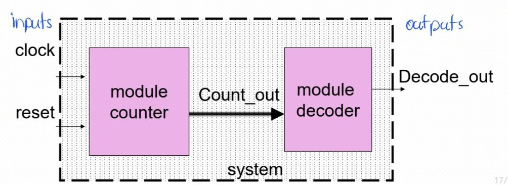

# DSL Notes

## Verilog HDL
* Describes digital system as set of modules
* Module represents a logical unit that can be described by:
    * Structural description &rarr; internal logic structure eg. NAND, NOR gate
    * Behavioral description &rarr; writing descriptions for implementation of specific behaviour
* Each module has an interface to other modules + description of contents through port interface (inputs and outputs)
    * Ports are connections points that allow module to comm with other modules/external components &rarr; like pins on a physical chip
    * Modules are like different circuits that perform different tasks on a chip

## Verilog Conventions
### Number Types

| Number  	| Description               	|
|---------	|---------------------------	|
| Binary	| Base 2     	|
| Decimal 	| Base 10 	|
| Hexadecimal 	| Base 16: 0 to 9, then A to F	|

### Number Examples
| Number  	| Description               	|
|---------	|---------------------------	|
| 4'b1110 	| 4 bit binary number       	|
| 12'habc 	| 12 bit hexadecimal number 	|
| 16'd123 	| 16 bit decimal number     	|
| 23456 	| 32 bit decimal unsized number     	|
| 'he6  	| 32 bit hexadecimal unsized number e6     	|

* x &rarr; unknown value (6'hx is 6 bit unknown hex number)
* z &rarr; high impedance value (32'bz is 32 bit high impedance number)
* ? &rarr; altnerative of z for numbers (4'b10?? = 4'b10zz)

